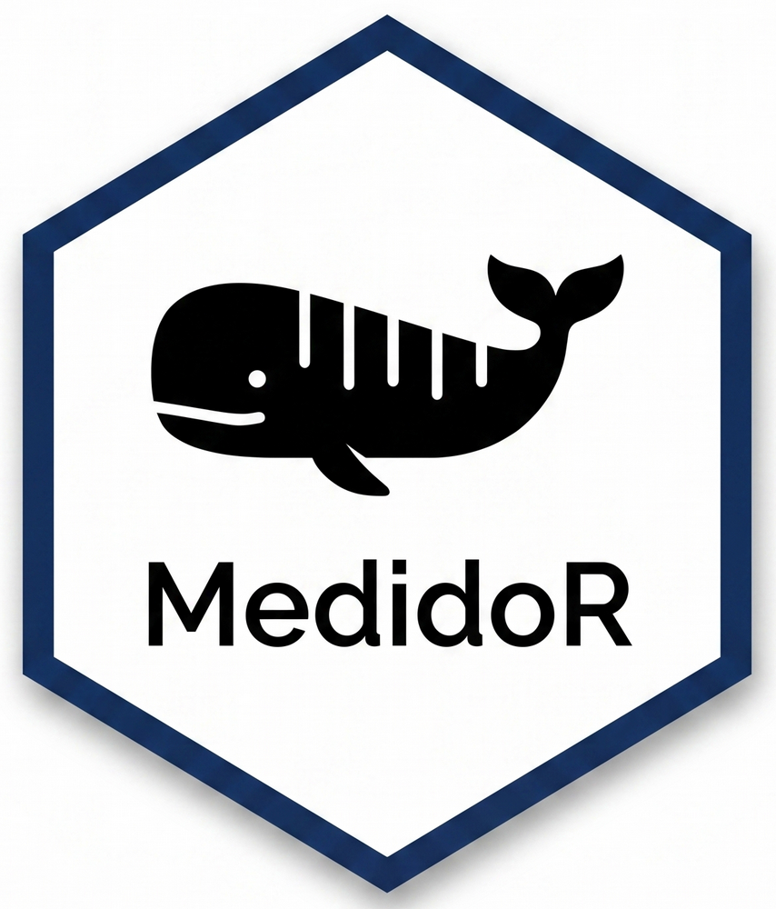

# MedidoR: Aerial Photogrammetry Analysis Tool



[](https://www.gnu.org/licenses/lgpl-3.0) [](https://doi.org/10.5281/zenodo.15865769)

`MedidoR` is an R package developed to optimize drone-based aerial photogrammetry for marine megafauna (eg., whales, dolphins, dugongs, and sharks). It provides interactive Shiny Graphical User Interfaces (GUIs) that seamlessly bridge the gap between empirical scale calibration modeling and automated morphometric body segmentation.

## Key Features

- **Integrated Scale Calibration:** Build linear regression models from reference flights over objects of known sizes to automatically correct drone barometric/altitude biases.
- **Statistical Validation:** Real-time generation of model diagnostic plots (Residuals vs Fitted, Q-Q Plot, Homogeneity of Variance) and accuracy metrics ($R^2$, RMSE, MAE).
- **Proportional Body Segmentation:** Automatically extracts body widths at 5% or 10% vertical intervals along the centerline for precise Body Condition Index (BCI) analysis.
- **Free Measurement Mode:** Flexible pixel-to-meter extraction for specific landmarks, body injuries, dorsal fins, or fluke widths.

## Installation

You can install the development version of `MedidoR` from GitHub with:

``` r
# Install devtools if not already installed
if (!require("devtools")) install.packages("devtools")

# Install MedidoR
devtools::install_github("deOliveira1996/MedidoR")

OR

if (!require("pak")) install.packages("pak")

# Install MedidoR
pak::pak("deOliveira1996/MedidoR")
```

## Usage

Launching the Application To start the MedidoR Shiny application:

``` r
library(MedidoR)

calib_GUI() # Calibration interface

medidor_GUI() # Morphometrics interface
```

## Contributing

- Contributing to `MedidoR`

Thank you for your interest in helping improve `MedidoR`! We welcome contributions from marine biologists, data analysts, and software engineers alike.

- Ways to Contribute

1.  **Report Bugs:** Submit an issue on our GitHub repository describing the error with a minimal reproducible example (`reprex`).
2.  **Feature Requests:** Open an issue to discuss new photogrammetric routines or support for novel drone sensors.
3.  **Code Contributions:** Fix open issues or implement features via Pull Requests.

- Pull Request Guidelines

- **Branching:** Always create a descriptive feature branch from the `develop` branch (e.g., `git checkout -b feature-gimbal-correction`). Do not push directly to `main`.

- **Code Style:** Follow the [tidyverse style guide](https://style.tidyverse.org/). Keep code clean and well-commented.

- **Testing:** `MedidoR` utilizes `testthat` and `shinytest2` to validate graphical interfaces. Before submitting any PR, execute `devtools::test()` locally to ensure all GUI states, image uploads, and crop functions are stable. If you introduce new features, you are expected to add corresponding tests.

- **Documentation:** Update functions documentation using `roxygen2` tags and regenerate package files using `devtools::document()`.

## Citation

If you use MedidoR in your research, please cite it as:

de Oliveira, L. L. (2026). MedidoR: Precision Aerial Photogrammetry for Marine Megafauna Research. Zenodo. <https://doi.org/10.5281/zenodo.15865769>

## License

This project is licensed under the GNU LGPL 3 - see the LICENSE file for details.

## Contact

For questions or support, please contact:

Lucas Lima de Oliveira - [oceano2014lucas\@gmail.com](mailto:oceano2014lucas@gmail.com)

GitHub issues: <https://github.com/deOliveira1996/MedidoR/issues>
